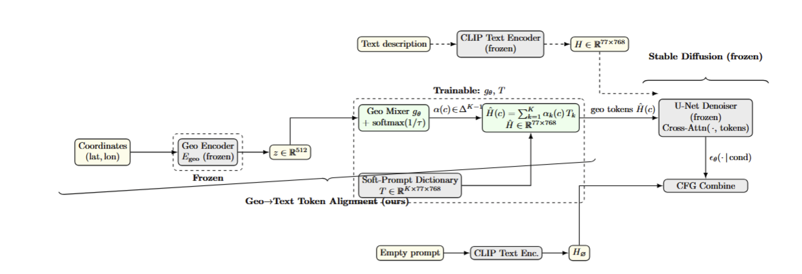

<div align="center">    
 
# 🌎 GeoCLIP: Clip-Inspired Alignment between Locations and Images for Effective Worldwide Geo-localization

[](https://arxiv.org/abs/2309.16020v2)


</div>

### 📍 Try out our demo! [](https://colab.research.google.com/drive/1p3f5F3fIw9CD7H4RvfnHO9g-J45qUPHp?usp=sharing)

## Description

This repository continues and builds on the GeoCLIP work: we reuse the GeoCLIP location encoder and CLIP-style image/text encoders, and combine them with a Stable Diffusion image generation pipeline to explore creative uses of the learned embedding space. Concretely, we test whether the GeoCLIP embedding space can be used to guide style transfer between cities (or any geographic region) by converting a target location's geo-embedding into prompt embeddings for an image-to-image Stable Diffusion pipeline. The result is a lightweight experimental pipeline that demonstrates geo-conditioned style transfer using either learned soft-prompt dictionaries or CLIP token anchors.


## Method

Similarly to OpenAI's CLIP, GeoCLIP is trained contrastively by matching Image-GPS pairs. By using the MP-16 dataset, composed of 4.7M Images taken across the globe, GeoCLIP learns distinctive visual features associated with different locations on earth.

## � Repository Structure

```
├── geoclip/                    # Core package
├── examples/                   # Usage examples  
├── experiments/               # Research code
├── scripts/                   # Training and utility scripts
├── tests/                     # Test suite
├── docs/                      # Documentation
└── assets/                    # Sample images and assets
```

See [docs/PROJECT_STRUCTURE.md](docs/PROJECT_STRUCTURE.md) for detailed information.

## 📎 Getting Started

### Installation

```bash
pip install geoclip_og
```

Or from source:
```bash
git clone https://github.com/VicenteVivan/geo-clip
cd geo-clip
pip install -e .
```

See [docs/INSTALLATION.md](docs/INSTALLATION.md) for detailed installation instructions.

### Quick Start

```python
from geoclip_og import GeoCLIP

model = GeoCLIP()
top_pred_gps, top_pred_prob = model.predict("path/to/image.jpg", top_k=5)
```

More examples are available in the [`examples/`](examples/) directory.

## Conda quickstart — how to install and run

If you use the included conda environment, follow these exact steps (run from the repository root):

1. Install the project dependencies into your conda environment (this example assumes the project created a local conda Python at `./.conda/bin/python` — adjust to your env):

```bash
# install runtime requirements
./.conda/bin/python -m pip install -r requirements.txt

# install the local package in editable mode so imports like `import geoclip_og` work
./.conda/bin/python -m pip install -e ./geoclip_og
```

2. Run examples using the same conda interpreter. It's best to run scripts as modules or via `runpy` to avoid import shadowing:

```bash
# preferred: run as module (ensures installed package resolution)
./.conda/bin/python -m examples.basic_inference

# alternative: run via runpy to ensure the installed package is used
./.conda/bin/python -c "import runpy; runpy.run_path('examples/basic_inference.py', run_name='__main__')"

# or set PYTHONPATH to repo root so example imports see the package
PYTHONPATH=. ./.conda/bin/python examples/basic_inference.py
```

3. Editor/IDE note: point VS Code (or your IDE) to the same interpreter `/.conda/bin/python` so linter and editor imports match the runtime environment.

Troubleshooting
- If you see "No module named 'geoclip_og'": ensure the editable install succeeded and you used the same interpreter. Run:

```bash
./.conda/bin/python -c "import importlib.util; print(importlib.util.find_spec('geoclip_og'))"
```

- If other modules are missing, install them into the conda env (they're listed in `requirements.txt`):

```bash
./.conda/bin/python -m pip install -r requirements.txt
```

- To make the project installable by name (so `pip show geoclip_og` works), the package metadata already uses `name='geoclip_og'` in `geoclip_og/setup.py`. Reinstall if you change the name.

If you'd like, I can add a small `env-setup.sh` script with these commands and a brief developer guide.

## Developer convenience: env-setup.sh

To automate the quick env setup used above, there's a helper script you can run from the repository root. It will install the requirements into the local conda python and install the package in editable mode.

```bash
# make the script executable and run it from repo root
chmod +x ./env-setup.sh
./env-setup.sh
```

The script runs the same commands shown above and is helpful for CI or onboarding new contributors.

## Assets and model bundles (where to put files for full runs)

The example and experiment scripts will run in a degraded but safe mode if they can't find checkpoints or sample images. To run end-to-end (recommended), place files in the following locations relative to the repository root:

- Sample images (used by examples and quick tests):
  - `assets/sample_images/tokyo.jpg`
  - `assets/sample_images/venice.jpg`
  - `assets/sample_images/tel_aviv.jpg`

- Soft-prompt model bundle (optional; when present the test harness will load trained weights):
  - `alignment/models/geo_softprompt_model_cities.pt`

- Other experiment checkpoints (optional):
  - `alignment/models/mixture_checkpoint_epoch_15.pth`

If you don't have the trained bundles, the scripts will use random initialization and print an informative warning telling you which file is missing and where to place it.

## 📖 Documentation

- **[API Reference](docs/API.md)** - Complete API documentation
- **[Installation Guide](docs/INSTALLATION.md)** - Setup and troubleshooting  
- **[Project Structure](docs/PROJECT_STRUCTURE.md)** - Repository organization
- **[Examples](examples/README.md)** - Usage examples and tutorials

## 🧠 Advanced: Soft Prompt Model

For advanced users interested in the underlying geographic-text alignment model, we provide our **Soft Prompt Dictionary** architecture - the chosen approach after extensive experimentation:

- **Training**: [`experiments/training_variants/train_softprompt_model.py`](experiments/training_variants/train_softprompt_model.py)
- **Configuration**: [`experiments/training_variants/softprompt_config.py`](experiments/training_variants/softprompt_config.py)  
- **Inference**: [`experiments/training_variants/softprompt_inference.py`](experiments/training_variants/softprompt_inference.py)
- **Model Comparison**: [`experiments/training_variants/README.md`](experiments/training_variants/README.md)

This model achieves state-of-the-art geographic-text alignment with only ~150K trainable parameters by learning a dictionary of "soft tokens" representing geographic concepts.

Our experiments demonstrate a practical application of this embedding space: we convert geographic embeddings into prompt embeddings and use them to condition a Stable Diffusion image-to-image pipeline so an input photo can be restyled in the visual "style" of a target city or location. See the experimental scripts:

- `tests/comprehensive_geo_test.py` — a configurable harness that runs many strength/guidance combinations and saves results for each image and location pair.
- `experiments/stable_diffusion/testing_single_example.py` — a compact example that runs a single geo-conditioned inference using the SoftPrompt dictionary mixer.

These experiments are intended to be illustrative; they use random weights when pre-trained checkpoints are not present and include guards that explain where to place model bundles and sample images for end-to-end runs.


## Acknowledgments

This project was largely based on the GeoClip Original project as cited here.
